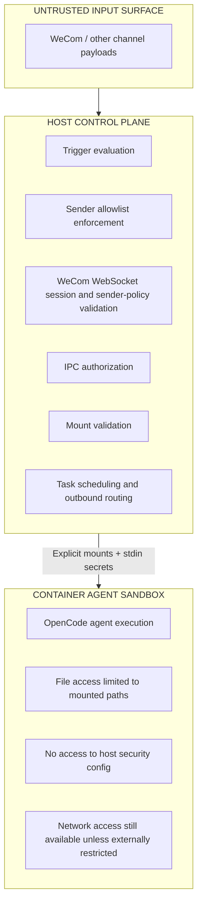

# 安全模型

## 信任模型

| 实体 | 信任级别 | 说明 |
|------|----------|------|
| 已注册的聊天 | 受信任的操作员界面 | 任何可以与系统对话的聊天都被视为完全授权 |
| 未注册的聊天 | 不受信任 | 元数据可能被观察到，消息内容不应进入 agent 上下文 |
| 容器 agents | 沙盒隔离 | 执行与主机代码和安全配置隔离 |
| 入站渠道载荷 | 不受信任的输入 | 必须通过触发器、传输和发送者策略检查 |

## 安全边界

### 1. 容器隔离是主要边界

Agent 在隔离的容器中运行，具备：
- 与主机的进程隔离
- 仅显式 bind mount
- 尽可能非 root 执行
- 每个群组的独立 OpenCode/session 存储
- 每个调用的临时容器生命周期

所有注册的聊天获得项目根目录作为只读。可写路径单独挂载。这防止 agents 改变主机应用程序代码并通过源代码编辑持久化沙盒逃逸。

### 2. 挂载安全外部化且防篡改

挂载权限位于 `~/.config/aeroloongclaw/mount-allowlist.json`，在仓库外部，永远不会挂载到容器内。

保护措施：
- 验证前解析符号链接
- 拒绝不安全的容器路径（`..`、意外的绝对路径）
- `nonMainReadOnly` 强制聊天只读挂载，即使存在更广泛的授权
- 阻止敏感模式如 `.ssh`、`.gnupg`、`.aws`、`.env`、`.netrc`

### 3. 群组/session 隔离减少跨聊天泄露

每个注册的群组获得：
- 自己的群组文件夹
- 自己的 IPC 命名空间
- 自己的 OpenCode 数据目录
- 自己的任务作用域和内存 surface

注册的聊天共享同一个控制平面，但仍然通过群组文件夹、IPC 命名空间和 session 状态保持隔离。

### 4. IPC 授权在主机侧强制执行

敏感操作不仅仅因为容器请求就信任。主机在应用之前重新检查授权：

| 操作 | 已注册聊天 |
|------|-----------|
| 向自己的聊天发送消息 | 是 |
| 向其他聊天发送消息 | 是 |
| 注册新群组 | 是 |
| 授权新发送者 | 是 |
| 为自己的群组调度任务 | 是 |
| 为其他群组调度任务 | 是 |

这很重要，因为仅靠工具级限制是不够的；容器被视为可能被入侵的，主机是最终执行点。

### 5. 凭证处理被过滤，而不是完全隔离

凭证从 `.env` 读取，在需要时通过 stdin JSON 传递给容器。它们不作为文件挂载。

当前传递给容器的提供商凭证：
- `CLAUDE_CODE_OAUTH_TOKEN`
- `ANTHROPIC_API_KEY`
- `ANTHROPIC_BASE_URL`
- `OPENAI_API_KEY`
- `GOOGLE_API_KEY`
- `GEMINI_API_KEY`
- `MINIMAX_API_KEY`

主机专用密钥和状态：
- 渠道 auth/session 数据如 `store/auth/`
- 挂载白名单
- 发送者白名单
- WeCom Bot ID / Secret 接线以及主机文件系统上的健康状态

Release 安装通过以下方式将这些路径移出 release 目录：
- `AEROLOONGCLAW_ENV_FILE`
- `AEROLOONGCLAW_STORE_DIR`
- `AEROLOONGCLAW_DATA_DIR`
- `AEROLOONGCLAW_GROUPS_DIR`
- `AEROLOONGCLAW_CUSTOM_SKILLS_DIR`

**残余风险**：运行的 agent 仍然可以故意访问传递到其沙盒的提供商凭证。系统通过文件系统隔离减少爆炸半径，而不是通过每个工具的凭证保险库。

### 6. WeCom 特定控制

WeCom 渠道添加了额外的主机侧控制平面：
- 主机使用 Bot ID / Secret 发起 WebSocket 长连接
- 主机上不暴露公共入站回调端点
- 连接、入站和发送健康状态记录在 `store/wecom-health.json`
- WeCom 启动前发送者策略必须显式 fail-closed
- 未注册的 WeCom 群组消息不进入消息表
- 已注册的 WeCom 群组默认安静，只在显式被 @ 时响应

发送者白名单优先级：
1. 聊天特定策略
2. 渠道默认（`channelDefaults.wecom`）
3. 全局默认

如果 `WECOM_ENABLED=true` 但 `channelDefaults.wecom` 缺失或过于宽松，只有 WeCom 渠道被禁用。其他渠道继续运行。`wecom-doctor` 报告确切的政策问题和所需修复。

## 可操作性和诊断

安全检查只有在操作员能看到 drift 时才有用。项目现在提供：
- `npm run wecom:doctor` 用于 WeCom 专项诊断
- `store/wecom-health.json` 用于最近的连接 / 入站 / 发送状态
- WebSocket 失败、入站处理错误和发送者策略拒绝的结构化日志

不可用的运行时证据报告为 `unknown`，而不是被视为健康。

## 安全架构图

