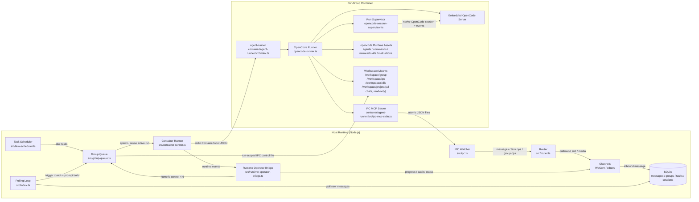
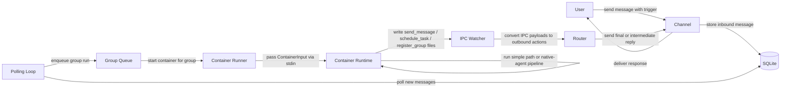
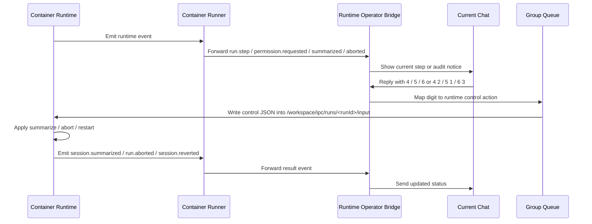
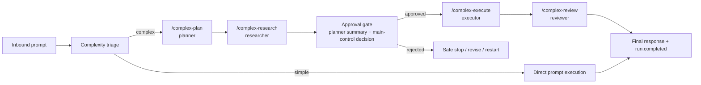

# 系统架构

本文档描述当前版本的实际运行架构，重点是：

- 一条普通消息如何进入系统并得到回复
- 当前对话线程如何观察和控制本线程正在运行的任务
- 容器内的 OpenCode runtime 如何执行固定 native-agent 流水线

## OpenCode-First 约束

当前架构的默认约束是：新增运行时能力时，先尝试使用 OpenCode 原生 surface 表达，包括 `instructions`、`.opencode` 资产、`agents`、`commands`、`skills`、provider/MCP 配置、events 和公开 SDK API。只有在这些原生能力无法覆盖需求，或者必须处理消息通道、主机侧密钥、容器隔离、文件边界等宿主职责时，才新增 AeroLoongClaw 自定义桥接层。

## 系统图

## 主要数据流

## 运行时控制流

控制线程不是单独的 Web UI，而是当前消息对话本身。当前协议主路径是数字回复 `4-6`；当同群有多个活跃 run 时，可用 `4 2`、`5 1`、`6 3` 指定槽位。

## 容器运行时流

复杂任务的当前正式主路径是固定 native-agent 流水线，不再依赖 `team_*`。

## 各层职责

### 主机侧

- Channel adapters 接收和发送消息
- SQLite 存储消息、群组、sessions、任务和路由状态
- `src/index.ts` 轮询入站消息并编排执行
- `src/group-queue.ts` 确保按群组串行执行，全局并发上限
- `src/container-runner.ts` 启动容器、绑定挂载、传递 stdin 输入、解析结构化 stdout
- `src/ipc.ts` 消费容器写入的 IPC 文件
- `src/runtime-operator-bridge.ts` 将运行时事件转换为 boss 面向的更新和数字控制

### 容器侧

- `container/agent-runner/src/index.ts` 读取 stdin 并启动运行时
- `opencode-runner.ts` 启动嵌入式 OpenCode server，写入 config/assets，协调消息/控制循环
- `opencode-session-supervisor.ts` 监督实时运行，正规化事件，处理 summarize / abort / restart 语义
- `ipc-mcp-stdio.ts` 暴露 host 面向的工具如 `send_message`、`schedule_task`、`register_group`
- `.opencode/` 资产按群组生成并发布到挂载的工作区

## 挂载数据边界

每个活跃群组，容器获得隔离的挂载：

- `/workspace/group`：该群组的可写工作区
- `/workspace/ipc`：该群组的 IPC 命名空间
- `/workspace/skills`：只读运行时 skills
- `/workspace/project`：每个授权聊天的只读主机项目挂载
- `/home/node/.local`：按群组的 OpenCode 数据目录

## 当前运行时契约

### 容器 stdin

Host 传递 `ContainerInput` JSON payload，包含：
- prompt
- runId
- sessionId
- groupFolder
- chatJid
- secrets
- model
- runtimeFlags
- mounted skill metadata

### 容器 stdout

结构化输出包装在：
- `---AEROLOONGCLAW_OUTPUT_START---`
- `---AEROLOONGCLAW_OUTPUT_END---`

`src/container-runner.ts` 解析这些标记来提取 `ContainerOutput`。

### 运行时事件

当前正规化运行时事件包括：
- `run.started`
- `run.step`
- `run.blocked`
- `permission.requested`
- `permission.resolved`
- `session.summarized`
- `session.reverted`
- `run.completed`
- `run.aborted`
- `run.failed`
- `workspace.reloaded`

### Boss 端数字协议

- `1`：同意这一次
- `2`：后面都同意
- `3`：先不要做
- `4`：现在进展
- `5`：停下来
- `6`：从头再来

## 代码阅读顺序

如果你要顺着代码追一条真实消息，推荐顺序：

1. `src/index.ts`
2. `src/group-queue.ts`
3. `src/container-runner.ts`
4. `container/agent-runner/src/opencode-runner.ts`
5. `container/agent-runner/src/opencode-session-supervisor.ts`
6. `container/agent-runner/src/ipc-mcp-stdio.ts`
7. `src/ipc.ts`
8. `src/runtime-operator-bridge.ts`
