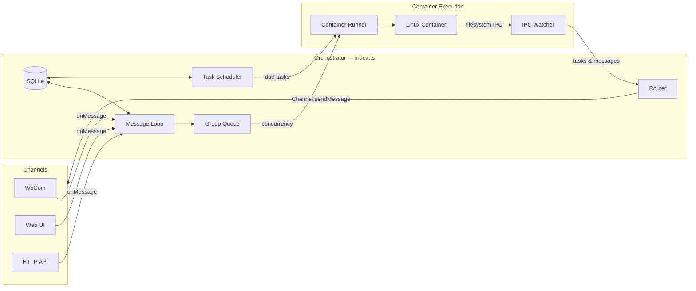

# 技术规格

本文档是 AeroLoongClaw 技术规格的概述，完整规格见 [`docs/SPEC.md`](https://github.com/AeroLoongAI/aeroloongclaw/blob/main/docs/SPEC.md)。

## 核心能力

| 能力 | 说明 |
|------|------|
| 多渠道接入 | 企业微信、Web UI、HTTP API |
| 消息驱动 | 轮询 SQLite，消息触发 agent 执行 |
| 容器隔离 | 每个任务在独立 Docker 容器中运行 |
| 持久化记忆 | 每个对话独立存储 session 和上下文 |
| 计划任务 | 支持 cron 表达式调度 |
| MCP 集成 | 支持 MCP servers 扩展能力 |

## 技术栈

| 组件 | 技术 | 用途 |
|------|------|------|
| 渠道系统 | Channel registry (`src/channels/registry.ts`) | 渠道自注册 |
| 消息存储 | SQLite (better-sqlite3) | 轮询消息 |
| 容器运行时 | Docker (Linux containers) | Agent 执行隔离 |
| Agent | OpenCode (@opencode-ai/sdk) | 带工具和 MCP servers 的 agent |
| 浏览器自动化 | agent-browser + Chromium | Web 交互和截图 |
| 运行时 | Node.js 20+ | 路由和调度 |

## 架构要点

### 渠道自注册

每个渠道（如 WeCom）作为独立模块，在启动时调用 `registerChannel()` 自注册。缺少凭证时返回 `null`，渠道被跳过。

```typescript
registerChannel('wecom', (opts: ChannelOpts) => {
  if (!existsSync(authPath)) return null;
  return new WeComChannel(opts);
});
```

### IPC 机制

容器与主机通过文件系统 IPC 通信：
- 容器写入 JSON 文件到 `/workspace/ipc/{group}/`
- 主机 IPC Watcher 消费这些文件
- 通过 `input/_close` sentinel 关闭

### 容器协议

**stdin**：Host 传递 `ContainerInput` JSON
**stdout**：结构化输出包装在 `---AEROLOONGCLAW_OUTPUT_START---` 和 `---AEROLOONGCLAW_OUTPUT_END---` 之间

### 安全边界

1. **容器隔离**：进程隔离、显式 bind mount、非 root 执行
2. **挂载白名单**：`~/.config/aeroloongclaw/mount-allowlist.json`
3. **IPC 授权**：敏感操作在主机侧重新检查授权
4. **凭证处理**：`.env` 通过 stdin JSON 传递，不挂载文件

## 数据布局

```
groups/{name}/           → /workspace/group (容器内)
data/sessions/{group}/    → /home/node/.local (容器内)
data/ipc/{group}/        → /workspace/ipc (容器内)
skills/                   → /workspace/skills (容器内，只读)
```

## 消息流



## 扩展阅读

- 完整规格：[`docs/SPEC.md`](https://github.com/AeroLoongAI/aeroloongclaw/blob/main/docs/SPEC.md)
- 架构详情：[架构文档](./architecture)
- 配置参考：[环境变量](./config)
